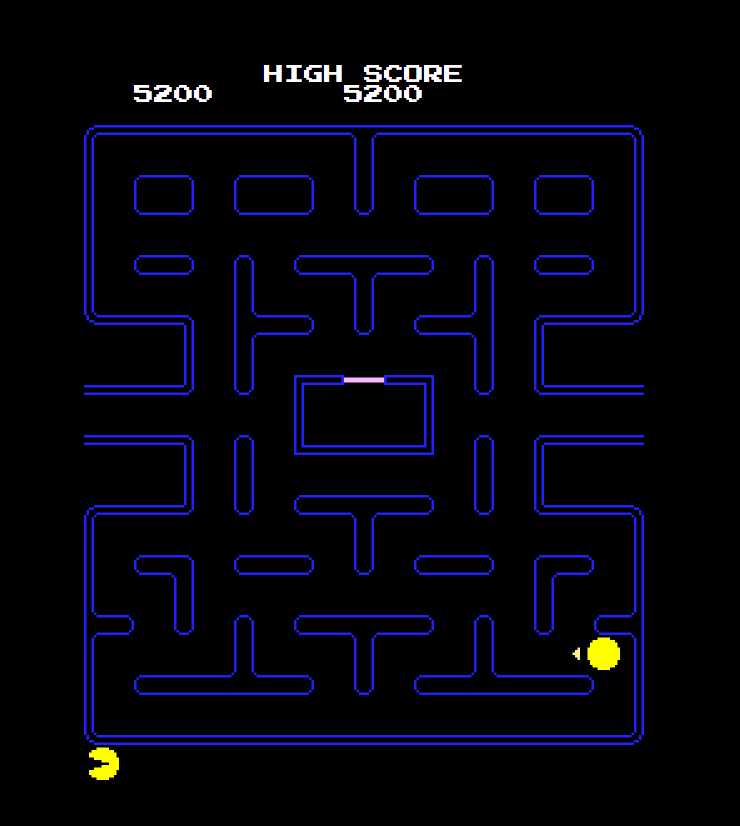

# Pacman game contenarization

This project is a Node.js Pacman game built with Docker and CI/CD optimization using GitHub Actions.

## Dockerfile

The Dockerfile in this repository is structured as follows:

- It starts with a base image containing Node.js (version 14.21.3).
- The subsequent commands in the Dockerfile are executed relative to the working directory inside the container to /usr/src/app.
- Copies package.json and package-lock.json to the working directory and installs dependencies.
- Copies the entire project directory into the container.
- Exposes port 8080 to the outside world.
- Specifies the command to run the application using npm run serve.

## GitHub Actions Workflow

The GitHub Actions workflow in this repository automates the build process and performs security scans.
It triggers on pushes and pull requests to the main branch. The workflow consists of the following steps:

1. **Checkout repository**: Clones the repository into the GitHub Actions runner environment.
2. **Set image tag**: Sets the tag for the Docker image using the GitHub run number. Currently working on version 1.x, x=Github run number. The idea is that the major versions will be manually changed after a big development difference in the application.
3. **Build Docker image**: Builds the Docker image using the Dockerfile and sets the tag.
4. **Security Scan with Trivy**: Runs a security scan on the Docker image using Trivy, checking for vulnerabilities with severity level CRITICAL. If there is a CRITICAL vulnerability, the CI fails with exit code 1.
5. **Push Docker image to Docker Hub**: Tags the Docker image with set image tag, logs in to Docker Hub using Action secrets, and pushes the image to Docker Hub if the event is a push to the main branch. If a CRITICAL vulnerability is present, the Docker image will not be uploaded.

## Replication

To replicate this setup:

1. Clone the repository locally.
2. Ensure Docker and Docker Hub credentials are set up.
3. Create Action secrets in the repository settings for Docker Hub username and password.
4. Make changes to the Dockerfile and GitHub Actions workflow.
5. Push changes to a new branch and open a pull request.
6. Monitor the GitHub Actions workflow for successful execution.
7. Merge the pull request in order to push the successfully build and secure image to Docker Hub.

## Notes

- Modify the Dockerfile and GitHub Actions workflow as needed to fit specific project requirements or environments in case of additional application changes.

# Good luck. Have fun.

